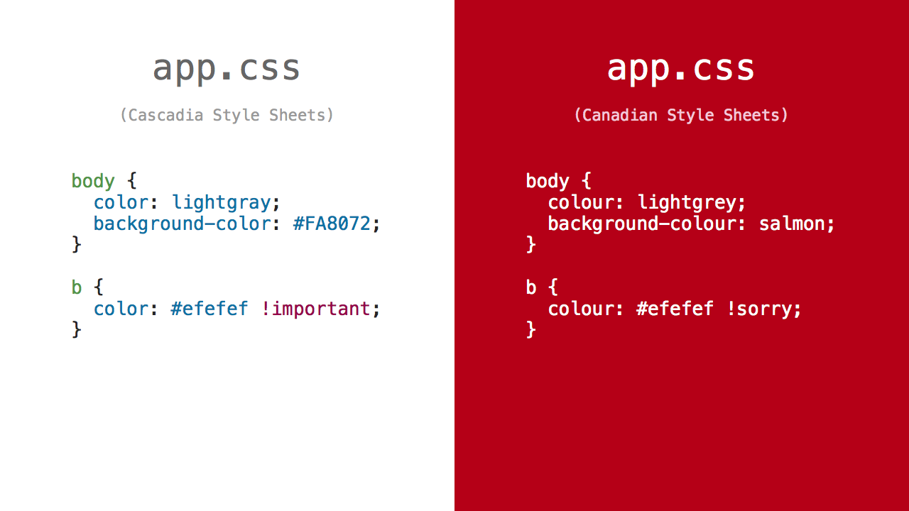

# Ember CLI Canadian Stylesheets [](https://travis-ci.org/chancancode/ember-cli-canadian-stylesheets)



## Usage

Run this inside an Ember CLI application:

```sh
npm install ember-cli-canadian-stylesheets --save-dev --save-exact
```

Then restart your server.

## PostCSS

Under the hood, this uses [PostCSS] to apply the CSS transformations. If you are
already using [ember-cli-postcss](https://github.com/jeffjewiss/ember-cli-postcss),
you can also use the [postcss-canadian-stylesheets](https://github.com/chancancode/postcss-canadian-stylesheets)
plugin directly instead of using this convenience package.

[PostCSS]: https://github.com/postcss/postcss
